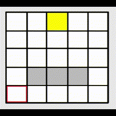

# Sand 2

My third sand falling and spreading simulation. With a graphical interface.

## Introduction

This is my third simulation of sand falling and spreading on a surface. It is written in C and uses the [PXEG](https://github.com/ZiplEix/PXEG) (a pixel engine that a write on my own after testing SPEX) library to display the simulation.

> This code is juste a test of the PXEG library, it is not optimized and it is not very good : the code is messy an unreusable. this version of sand simulation is juste to demonstrate the capabilities of the PXEG library.

## Installation

### Pre-requisites

- A C compiler (by default `gcc` is used but you can change ir in the `Makefile` line 12)
- The [SDL2](https://www.libsdl.org/) library and his dependencies

### Compilation

To compile the program, run the following command:

    make

## the algorythm

The algorythm is very simple. It is based on the fact that sand will fall down if there is nothing under it. If there is something under it, it will spread on the side if there is nothing.

## Usage

To run the program, run the following command:

    ./sand_simulation

## Controls

> No controle for this version

## Configuration

This programme is ony configurate in the source code. You can only change the size of the simulation in the `main.c` file.
